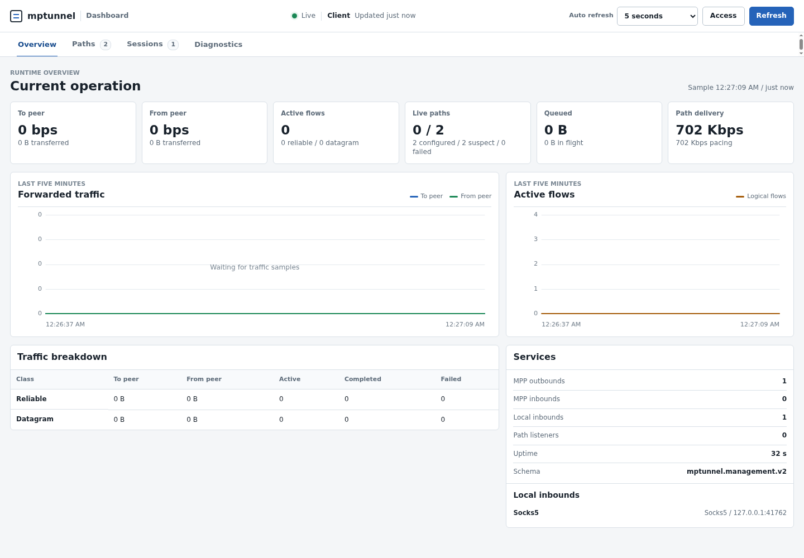

# mptunnel

`mptunnel` is an encrypted multipath proxy and tunnel written in Rust. It
carries reliable streams and datagrams over TCP, QUIC over UDP, or both while
keeping TCP and QUIC congestion control and recovery in their native transport
layers.

The shared Multipath Proxy Protocol (MPP) data layer provides directional data
sequence numbers, Data ACKs, flow control, measured path selection,
cross-path reinjection, and failover. The current wire format is MPP v4 and is
not compatible with protocol v1, v2, or v3.

> **Release status:** v0.1.2 is the current stable release. The protocol is
> custom and has not received an independent security audit. Review the
> [security and platform limitations](#security-and-limitations) before
> exposing a deployment.

## Features

- Aggregate healthy paths for sustained reliable traffic without assigning a
  permanent role to a link.
- Prefer measured completion cost for latency-sensitive work, then use
  additional measured capacity when demand grows.
- Preserve one reliable data sequence space across TCP and QUIC carrier paths.
- Carry SOCKS5, HTTP CONNECT, fixed-target local TCP/UDP port forwards, TUN
  TCP/UDP, and MPP datagram flows.
- Apply ordered routing, destination ACLs, split/encrypted DNS, host overrides,
  and bounded FakeDNS through one strict Product policy.
- Select direct, source-bound, SOCKS5, HTTP(S) CONNECT, or independent MPP
  outbounds through configurable failover, latency, load, random, or manual
  balancers.
- Continue a reliable flow across a failed carrier through bounded
  data-level reinjection.
- Inspect paths, sessions, flows, and forwarded traffic through a local
  management API and embedded dashboard.

## Measured performance

The Core-frozen v0.1.2 no-feature GNU/Linux candidate was guarded on five
equal 500 Mbps, 180 ms one-way-delay paths with no configured loss. Each row
used two concurrent flows for 30 seconds. Product-only edits followed this
cohort, so these are not measurements of the eventual tagged executable.

| Reliable carrier | Direction | Goodput | Result | Material path use |
| --- | --- | ---: | --- | --- |
| MPP over TCP | download | 799.384 Mbps | complete | five |
| MPP over QUIC | download | 712.382 Mbps | complete | five |
| MPP over QUIC | upload | 747.305 Mbps | receiver-confirmed lower bound; 1.027% drain tail | five |
| MPP over TCP | upload | 559.969 Mbps | receiver-confirmed lower bound; 0.515% drain tail | two sustained owners |

Ten-second-drain diagnostic reruns confirmed every locally accepted upload
byte: 3,017,867,264 bytes over QUIC and 2,230,910,976 bytes over TCP. The
extended drain is lifecycle evidence, not an acceptance setting. These
dirty-tree, single-run Core guards establish scoped protocol correctness and
aggregation behavior; they are not tagged-binary acceptance, matched
competitive proof, or an Internet-speed guarantee. The historical v0.1.1
comparison and failover cohorts remain documented separately and are not
rebound to protocol v4.

An isolated movement around five percent is ordinary measurement fluctuation,
not a hard pass/fail threshold. Performance acceptance uses repeated paired
evidence and has no universal percentage cap.

See [Performance evidence](docs/PERFORMANCE.md) for methodology, representative
measurements, failover results, and limitations.

## Install

The current packaging workflow produces the obvious OS/architecture archives
below plus one `SHA256SUMS` manifest. v0.1.2 uses these stable names; the
historical [v0.1.1 release](../../releases/tag/v0.1.1) keeps its immutable,
versioned Rust-target filenames.

| Platform | Release asset |
| --- | --- |
| Linux amd64 | `mptunnel-linux-amd64.tar.gz` |
| Linux arm64 | `mptunnel-linux-arm64.tar.gz` |
| Windows amd64 | `mptunnel-windows-amd64.zip` |
| Windows arm64 | `mptunnel-windows-arm64.zip` |
| macOS amd64 | `mptunnel-macos-amd64.zip` |
| macOS arm64 | `mptunnel-macos-arm64.zip` |
| Android arm64 CLI | `mptunnel-android-arm64.tar.gz` |

Release filenames intentionally omit the version so
`releases/latest/download/<asset>` links remain stable. The release page and
the binary's `--version` output identify the version.

Verify one downloaded Linux archive before extracting it:

```bash
asset=mptunnel-linux-amd64.tar.gz
grep "  ${asset}$" SHA256SUMS | sha256sum -c -
```

On macOS, replace `sha256sum` with `shasum -a 256`. On Windows, compare
`Get-FileHash <archive> -Algorithm SHA256` with the matching `SHA256SUMS`
line. Each compact archive contains the binary, a package README, `LICENSE`,
and usable client/server examples. Linux also includes a systemd unit and
Windows includes its pinned Wintun DLL. The macOS archive intentionally ships
no privileged service definition. The Android archive contains the command-line
binary built by the pinned NDK lane; it is not an APK or a one-click
`VpnService` application.

## Quick start

Generate one credential file and transfer it securely to both endpoints:

```bash
umask 077
openssl rand -hex 32 > mpp-credential.key
```

PowerShell:

```powershell
(New-Guid).Guid | Set-Content -NoNewline mpp-credential.key
```

Configure an independent TLS certificate/private key on the server and
distribute its certificate to the client as a trust pin. Then start the server:

```bash
mptunnel --credential-id home-2026 \
  --principal-id home \
  --credential-secret-file ./mpp-credential.key \
  server \
  --bind-path tcp://0.0.0.0:4433 \
  --bind-path udp://0.0.0.0:4433 \
  --tls-certificate-chain ./server-cert-chain.pem \
  --tls-private-key ./server-private-key.pem \
  --outbound-protocol direct
```

Start the client with the same credential file and the pinned server identity:

```bash
mptunnel --credential-id home-2026 \
  --credential-secret-file ./mpp-credential.key \
  client \
  --socks5-listen 127.0.0.1:1080 \
  --http-listen 127.0.0.1:8080 \
  --tls-server-name server.example \
  --tls-pinned-certificate ./server-cert.pem \
  --path tcp://server.example:4433 \
  --path udp://server.example:4433
```

The client now exposes SOCKS5 on `127.0.0.1:1080` and HTTP CONNECT on
`127.0.0.1:8080`. TCP and UDP listeners can share a numeric port because
they are separate transports. Established logical streams are retained for
five minutes when every carrier is unavailable; change that policy with
`--session-retention-timeout-ms` or `[session].retention_timeout_ms`.

Advanced outbound carrier paths may use an inclusive port interval such as
`udp://server.example:20000-40000`. Each new physical carrier selects one port;
all advertised ports must reach the server's fixed TCP or UDP listener through
the deployment's forwarding or redirect rule. See
[`examples/config.reference.toml`](examples/config.reference.toml) for the
strict syntax and ownership boundary.

For repeatable deployments, put the same graph in `config.toml`. Every
inbound, outbound, balancer, route rule, ACL rule, DNS upstream, DNS plan, and
DNS rule has an explicit canonical `name`. Configured-resource references use
the resource term (`inbounds`, `outbound`, `balancer`, or `dns_plan`);
`credential_id`, `principal_id`, `rule_set_id`, and `publisher_id` are
protocol or signed-artifact identities. `target` is reserved for an
application or active-probe destination authority; `endpoint` is reserved for
a listener, connector, or carrier network endpoint. MPP carrier `paths` and
security are scoped to their MPP inbound or outbound. Validate without opening
listeners, then start it:

```bash
mptunnel --config ./config.toml --check-config
mptunnel --config ./config.toml
```

Fixed-target port forwards use `protocol = "tcp-forward"` or
`protocol = "udp-forward"` with required `listen` and `target = "host:port"`.
They enter the same routing, DNS, ACL, outbound, and balancer pipeline as the
proxy inbounds. See `examples/config.reference.toml` for the bounded TCP
connection and UDP association controls. The simple client CLI accepts one of
each through `--tcp-forward-listen`/`--tcp-forward-target` and
`--udp-forward-listen`/`--udp-forward-target`.

Use `mptunnel --help`, `mptunnel client --help`, and
`mptunnel server --help` for the complete CLI and environment-variable
surface. Listener, path, bind, and resolver options may be repeated for
explicit IPv4 and IPv6 addresses.

## Operator commands

The canonical TOML file is also the operational profile. These commands load
and validate it without starting a tunnel:

```bash
mptunnel --config ./config.toml doctor
mptunnel --config ./config.toml --principal-id local-user route explain \
  --target api.example:443 --network tcp \
  --source 127.0.0.1:41000 --inbound local-socks
```

Add `--resolved-ip 192.0.2.10` to explain post-resolution routing. Optional
route inputs are deliberately limited to attributes every live ingress
provides: destination, resolved IP, network, source, principal, and inbound.
The result separately names the pre-resolution rule and DNS plan that owned
resolution, then the selected stage rule, action and outbound. It also shows
every rule's first mismatch and any verified signed rule-set identity.

When `[management]` is enabled, the same config supplies its first loopback
listener and referenced token:

```bash
mptunnel --config ./config.toml status
mptunnel --config ./config.toml dns status
mptunnel --config ./config.toml dns explain example.com
mptunnel --config ./config.toml dns query example.com --type AAAA
mptunnel --config ./config.toml dns flush --dns-plan default
```

Alternatively pass `--address 127.0.0.1:7600` and a
`--management-token-file` or `--management-token-env` reference. Status and
DNS results are formatted JSON; token values are never accepted as CLI
arguments or printed. DNS flush is the only mutating command above.

## Dashboard

The management server is opt-in, token-protected, and restricted to loopback
listeners. Add these options to either the client or server command:

```bash
--management-listen 127.0.0.1:7600 \
--management-token-file ./management-token.key \
--management-dashboard
```

Open `http://127.0.0.1:7600/`. The dashboard shows current Product balancer
readiness and explicit drain/pin controls, path state and metrics, forwarded
traffic rates and history, sanitized inbound/outbound inventory, sessions, and
active flows with their origin and selected egress.
Runtime data, health, and controls are authenticated under `/api/v2/`; only
the static dashboard assets are public.



Peer path diagnostics are disabled by default. Enable
`--management-allow-peer-diagnostics` on the endpoint that may answer a
request. The same 1 s, 5 s, 30 s, or manual-only dashboard cadence refreshes
local status and the selected authenticated peer without overlapping cycles.
The response does not expose endpoints, targets, credentials, or other
sessions. See [Operations](docs/OPERATIONS.md#management-api) for the API
contract and remote-access guidance.

## Protocol model

```text
application ingress
    MPP reliable stream or datagram
        directional data sequence, Data ACK, receive window, reinjection
            available-first path scheduler
                TCP carrier controller | QUIC carrier controller
                    network
```

MPP borrows connection-level sequence, Data ACK, receive-window, reinjection,
and backup-path principles from MPTCP, plus directional path usage from
Multipath QUIC. It does not replace either transport's congestion controller or
loss recovery.

Configured `backup`, `expensive`, `bulk-allowed`, and related URI values are
operator restrictions. RTT, jitter, and rate URI values are startup priors.
Neither is a permanent traffic classification: live observations and current
demand rank eligible paths.

The normative wire contract is in [RFC.md](RFC.md). The implementation owners
and data flow are in [Architecture](docs/ARCHITECTURE.md).

## Platform support

| Platform | Release scope |
| --- | --- |
| Linux x86_64/aarch64 | Proxy and TUN runtime; Linux x86_64 is the primary end-to-end lab platform. TUN setup requires host network privileges. |
| Windows x86_64/aarch64 | Proxy runtime plus built-in managed Wintun generation, native route/DNS transaction, and socket bypass. GitHub Actions builds, tests, and packages MSVC x86_64/aarch64; a GNU-target PE has portable TCP and basic-UDP QUIC proxy evidence under Wine. Native Wintun throughput/failover remains unmeasured. |
| macOS x86_64/aarch64 | Proxy and low-level packet-device code is built for release. A daily-use product VPN still requires a signed, entitled Network Extension host for packet flow and route/DNS publication; a privileged helper or launchd job alone is insufficient. |
| Android arm64 | Host/core command-line artifact for shell validation and embedding work. It is not an APK, AAB, AAR, JNI library, or `VpnService` integration. |

Android VPN applications must obtain `VpnService` consent and call
`runtime::run_with_vpn_host_providers` with their packet-device provider,
carrier-network provider, and one `transport::HostSocketProtector`. The
protector synchronously receives a borrowed descriptor for every MPP carrier
and every MPTunnel-created native target/proxy/DNS TCP/UDP socket before connect
or first send; call `VpnService.protect` and return an error when it rejects the
descriptor. A catch-all host rejects operating-system DNS before startup
because the OS resolver's hidden sockets cannot be passed to this callback;
configure literal-bootstrap or outbound-backed DNS instead.
Apple packet-tunnel hosts use the same callback boundary for their native
network exclusion/binding. Run `mptunnel platform` for the current host report
and read [Platform lifecycle](docs/PLATFORM.md) and
[Operations](docs/OPERATIONS.md#platform-check) before enabling TUN.

Native TCP telemetry is adapted per platform: `TCP_INFO` on Linux/Android,
`TCP_CONNECTION_INFO` on macOS, and `SIO_TCP_INFO` where Windows provides
it. Correctness does not depend on telemetry. When it is unavailable,
`mptunnel` uses portable Data ACK and socket-backpressure evidence and logs the
selected telemetry mode.

QUIC normally uses Quinn's native UDP adapter. On Windows compatibility layers
that lack optional ECN or segmentation socket features, `mptunnel` falls back
to basic datagram I/O and logs the compatibility fallback. Quinn still owns
QUIC congestion control, packet recovery, and timeouts; native Windows uses the
optimized adapter when its socket capabilities are available.

## Security and limitations

- Use a random UUID or at least 32 bytes of high-entropy text for each named
  MPP credential. Do not reuse the management token as an MPP credential.
- TCP and QUIC use TLS 1.3 and the same independently configured server
  identity. TCP negotiates no ALPN, sends one fixed exporter-bound binary
  admission prelude, then carries raw MPP records; TCP never becomes HTTP.
- QUIC negotiates standard `h3`. An encrypted credential-derived selector
  gates request DATA before the MPP parser, then full MPP authentication still
  runs. HTTPS authority is bound to TLS SNI, so QUIC path groups use a DNS TLS
  identity even when carrier endpoints are literal IP addresses. Reliable
  records use H3 DATA and native UDP uses RFC 9297 datagrams. MPP credentials
  do not derive TLS certificates or trust, and 0-RTT is disabled.
- This presentation is not an indistinguishability or cover-service claim.
  Source-aware probes may still fingerprint the TLS/QUIC/H3 endpoint without
  producing a valid selector.
- Keep the built-in management listener on loopback. Use an SSH tunnel or a
  same-host TLS reverse proxy for remote access.
- This is a new custom protocol and implementation without an independent
  cryptographic or application-security audit.
- Controlled Docker and Wine results do not prove real-Internet, native
  Windows, native macOS, Android VPN, or Wintun performance.
- The measured Linux runtime used the GNU target, while release Linux archives
  use musl; the Wine run used a GNU-target PE, while Windows release archives
  use MSVC. Those packaged targets are not performance-equivalent claims.

## Development

```bash
cargo build --locked --release --bin mptunnel
cargo test --locked --all-features
cargo clippy --locked --all-targets --all-features -- -D warnings
```

The Docker lab changes networking only inside its namespaces. See
[Build and CI procedure](docs/CI.md), [Lab methodology](docs/LAB.md),
[Developer benchmarks](docs/BENCHMARKS.md),
[Code structure](docs/CODE_STRUCTURE.md),
[Product plan](docs/PRODUCT_PLAN.md),
[Performance/Core plan](docs/PERFORMANCE_PLAN.md), and
[Release operations](docs/OPERATIONS.md). Contributions follow
[CONTRIBUTING.md](CONTRIBUTING.md); report vulnerabilities through
[SECURITY.md](SECURITY.md).

## License

Licensed under the [Apache License 2.0](LICENSE).
