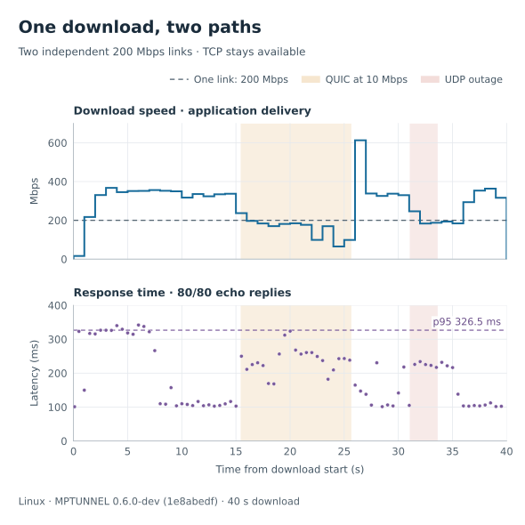
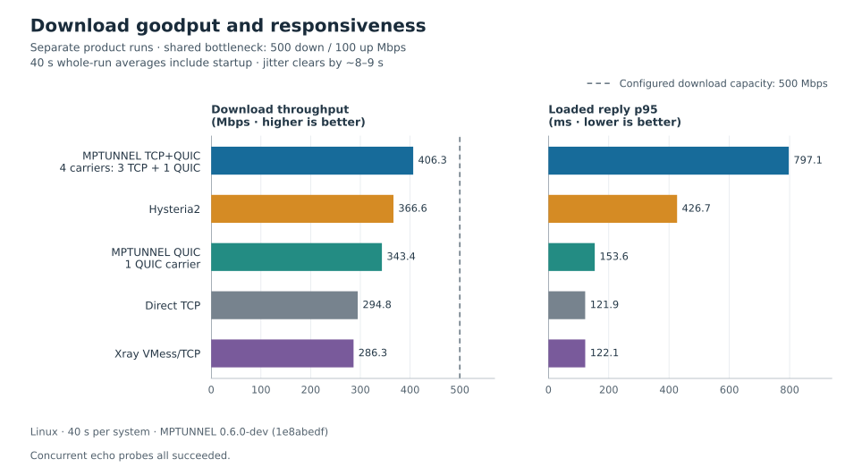
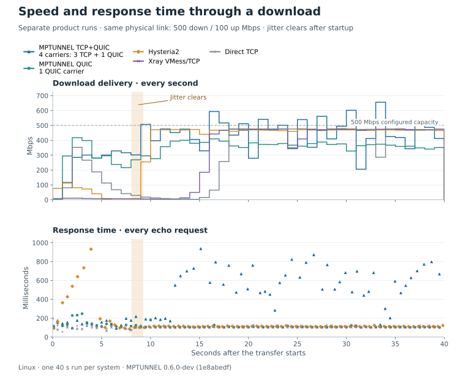

# Performance

MPTUNNEL combines the service available from several TCP and/or QUIC
**carriers**—the transport connections between its peers. A single application
transfer can use several carriers, while other applications share the same MPP
session. Carrier sets are configurable: TCP-only, QUIC-only or mixed, with a few
connections or tens.

The network underneath those carriers determines the available capacity. Carriers
on one Internet link share its bandwidth ceiling; parallel connections can still
help use that bandwidth when individual connections are limited. Carriers routed
over independent links can draw on each link's capacity. Both are aggregation;
they give the tunnel different resources to work with.

These experiments show what that means for a transfer: using two links,
continuing through a slowdown, and serving small requests during a large download.
They also compare throughput, latency and CPU cost with Hysteria2, Xray and direct
TCP. Each figure names the carrier set and network conditions used.

## One connection, two links

A single download uses **3 TCP carriers on one 200 Mbps link** and **1 QUIC
carrier on a separate 200 Mbps link**. The two links have independent bandwidth
limits. We slow the QUIC link to **10 Mbps**, restore it, then introduce a brief
UDP outage. The TCP link stays available throughout.

[](assets/performance/independent-paths.svg)

With both links available, the download exceeds either link's individual
capacity. When QUIC slows down or goes offline, the same download continues
over the TCP carriers. After recovery, it uses the added capacity again.
The second panel shows the response time of small requests alongside the
transfer.

Across the 40-second download, the application received **268 Mbps** on average;
all **80 small echo requests** completed. The longest pause between body reads
was **0.79 seconds**. A short burst after the restriction lifts is buffered data
reaching the application, so it can exceed the link rates on the chart.

We also fetch 100 kB HTTP responses on a fixed schedule alongside each transfer:

| Transfer | Average speed | HTTP responses completed | Completed late |
| --- | ---: | ---: | ---: |
| Download | 268 Mbps | 80 / 85 | 3 |
| Upload | 213 Mbps | 80 / 85 | 6 |

Five HTTP requests failed during each impaired transfer. A late response took
more than its 2.5-second budget. All 25 requests before and after each transfer
completed on time. [Both directions and the earlier-version comparisons](PERFORMANCE_DETAILS.md#independent-link-download-during-a-qos-change-and-udp-outage)
are included in the complete results.

Here aggregation lets one application use more capacity than either link supplies
alone, while retaining another way forward when one transport is restricted.

## Speed and responsiveness

Here all carriers in a run pass through one **500 Mbps download / 100 Mbps
upload** bandwidth limit: a shared bottleneck. Each system is tested separately
on that network. MPTUNNEL uses **3 TCP + 1 QUIC carriers** in the mixed case and
**1 QUIC carrier** in the QUIC-only case. These are two example configurations;
you can choose other carrier counts and combinations.

A download runs for 40 seconds while small echo requests measure responsiveness.
The link starts with jitter, which clears about eight to nine seconds into each run.

<a href="assets/performance/shared-link-tradeoffs.svg">
<picture>
  <source media="(max-width: 600px)" srcset="assets/performance/shared-link-tradeoffs-narrow.svg">
  
</picture>
</a>

MPTUNNEL's 3 TCP + 1 QUIC set delivered the most data over this interval, at
**406 Mbps**. The single QUIC carrier delivered **343 Mbps** with a **154 ms**
response p95, compared with **797 ms** for the mixed set. Hysteria2 delivered
**367 Mbps** with **427 ms** p95. Xray and direct TCP had the lowest response p95,
both **122 ms**.

For bulk transfers, throughput matters; for browsing or interactive work
alongside a download, response time matters too. Here the mixed set delivered
more bulk data while small requests took longer. The timing curves below show
both effects as conditions change.

<details>
<summary>Follow each download and response over time</summary>

[](assets/performance/shared-link-timeline.svg)

The timelines include startup, the change in jitter and every echo attempt.
The shaded band spans the recorded jitter changes across the five runs.
The curves show why the 40-second average differs from the speed reached later
in a transfer. All echo attempts completed; the sequential probe made 69–80 attempts
per system because it waits for each reply before sending the next request.

</details>

## CPU and memory on a VPS

Multipath delivery does extra work to schedule, track and recover data across
carriers. On a small VPS, CPU can become a limit before network bandwidth does.
The shared-link experiment above measured the following process CPU costs:

| System | Client CPU seconds / GiB | Server CPU seconds / GiB |
| --- | ---: | ---: |
| MPTUNNEL 1 QUIC | 17.6 | 25.1 |
| MPTUNNEL 3 TCP + 1 QUIC | 13.0 | 22.6 |
| Hysteria2 | 22.1 | 20.5 |
| Xray VMess/TCP | 2.5 | 1.2 |

Lower is better. These values count process CPU time per delivered GiB;
client and server costs are separate. Xray used substantially less CPU in this
comparison. Direct TCP has no tunnel process to measure.

Memory also grows with data in flight. For example, **1 Gbps at 100 ms RTT**
requires roughly **12.5 MB** in flight to fill the link. Recovery and reordering
need additional retained data. The [resource guide](OPERATIONS.md#resource-envelopes)
explains the available limits, and the
[memory measurements](PERFORMANCE_DETAILS.md#cpu-memory-and-traffic) report sampled
process residency for the earlier test set.

## Browsing alongside transfers, and longer runs

On a healthy 500 Mbps link shared by its carriers, MPTUNNEL's 3 TCP + 1 QUIC set
delivered **407 Mbps down** and **444 Mbps up**. All 55 loaded HTTP requests completed in
each direction; seven download-side and one upload-side request exceeded the
2.5-second response budget. These requests each fetched a 100 kB body on a fixed
schedule, so a slow response did not reduce the number of requests offered.

Five-minute transfers used one QUIC carrier on a 500 Mbps link and three TCP
carriers on a separate 200 Mbps link, with changing loss and jitter on QUIC.
Download averaged **226 Mbps**; upload averaged **387 Mbps**.
Combined endpoint traffic was **1.776 bytes per
downloaded byte** and **1.258 bytes per uploaded byte**, including acknowledgements,
control messages and recovery traffic.

The [complete measurements](PERFORMANCE_DETAILS.md) cover both directions,
reversed link capacities, swapped physical links, the loss/recovery scenarios
and comparisons with MPTUNNEL 0.5.2.

## Setup and data

The two main demonstrations use a Linux MPTUNNEL 0.6.0 development build
(`1e8abedf`), with one run per configuration. The release and measurement source
identities are separate; exact measurement hashes are in the data files.

For the shared-link comparison, endpoint containers have four CPU cores and
the router has two. Directional delay is 70/30 ms; initial jitter is 20/5 ms.
Hysteria2 2.10.0 uses Brutal at 500/100 Mbps. Xray 26.3.27 uses VMess over TCP
with `security: auto`, without mux or TLS. MPTUNNEL uses one QUIC carrier and,
in mixed mode, three TCP carriers with native BBR. No random loss is injected.

Download speed counts bytes delivered in order to the application. Upload speed
counts target-confirmed bytes through final settlement. Loaded response p95
is the response time met by 95% of successful echo requests. Echo points are
placed at the start of each request. The independent-link
chart marks the impairment windows; scheduled times and recorded command
timings are in its data file.

- [Measurements and test conditions](assets/performance/current-observations.json)
- [Independent-link time series](assets/performance/independent-paths-series.json)
- [Shared-link time series](assets/performance/shared-link-series.json)
- [Complete benchmark tables and earlier measurements](PERFORMANCE_DETAILS.md)
- [Earlier raw series](assets/performance/measurements.json)
- [Figure renderer](assets/performance/render.py)

To regenerate the main figures with Python and Matplotlib:

```bash
python3 docs/assets/performance/render.py
```
