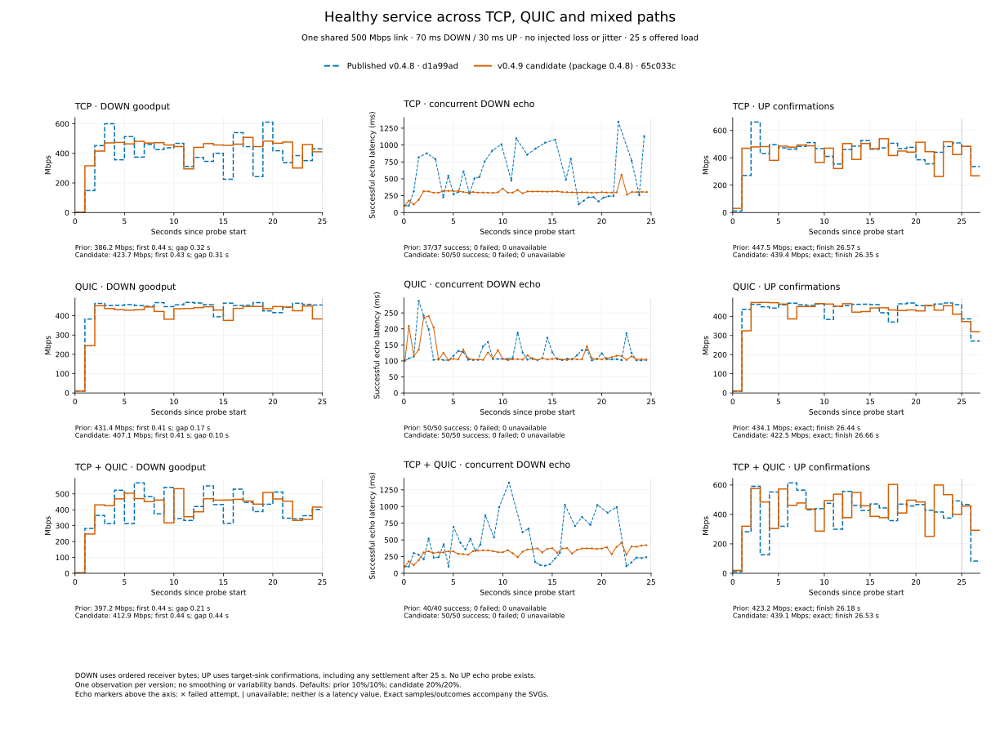
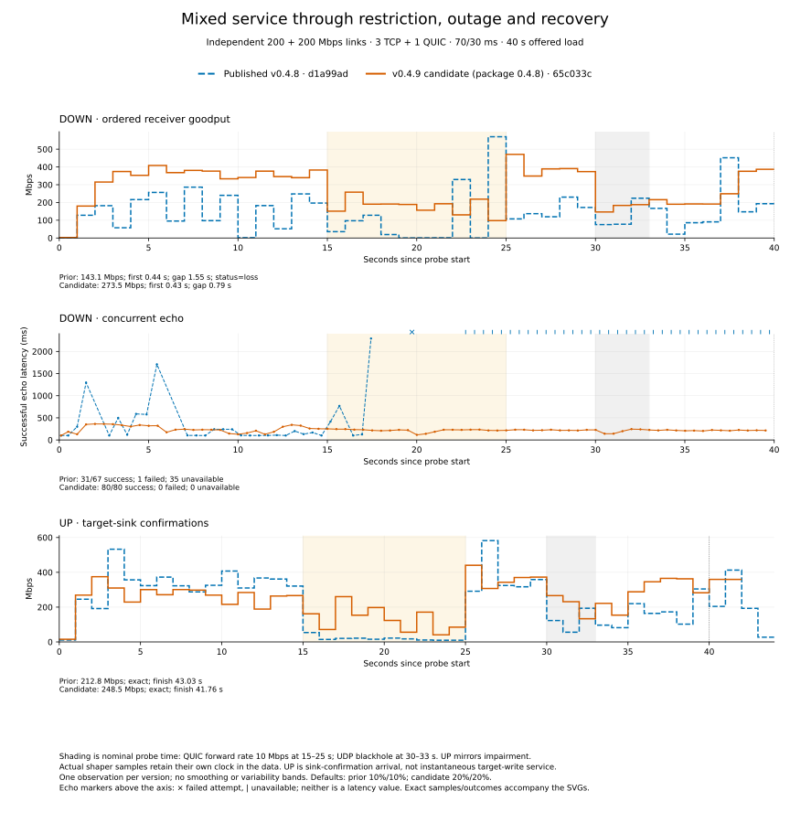
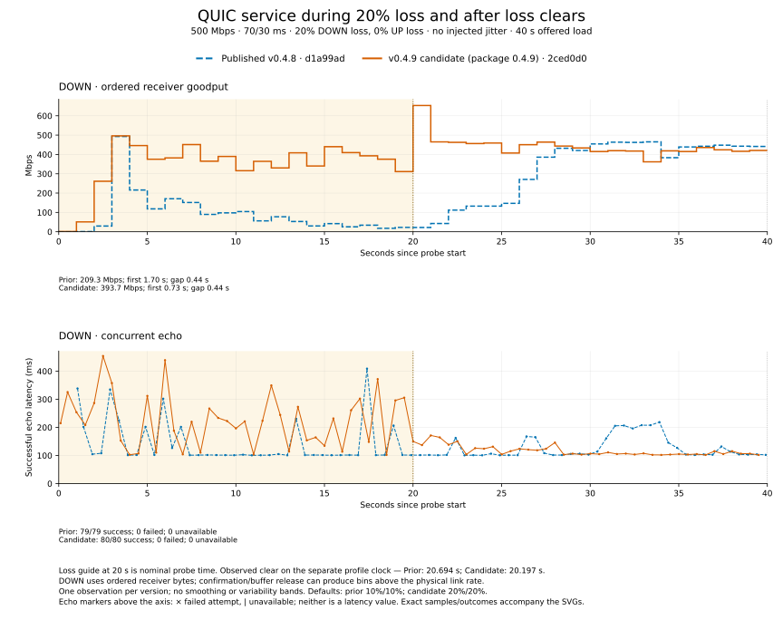
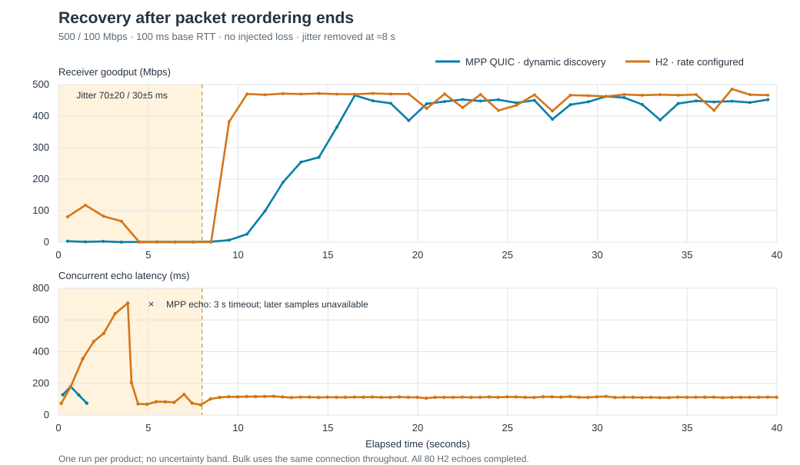
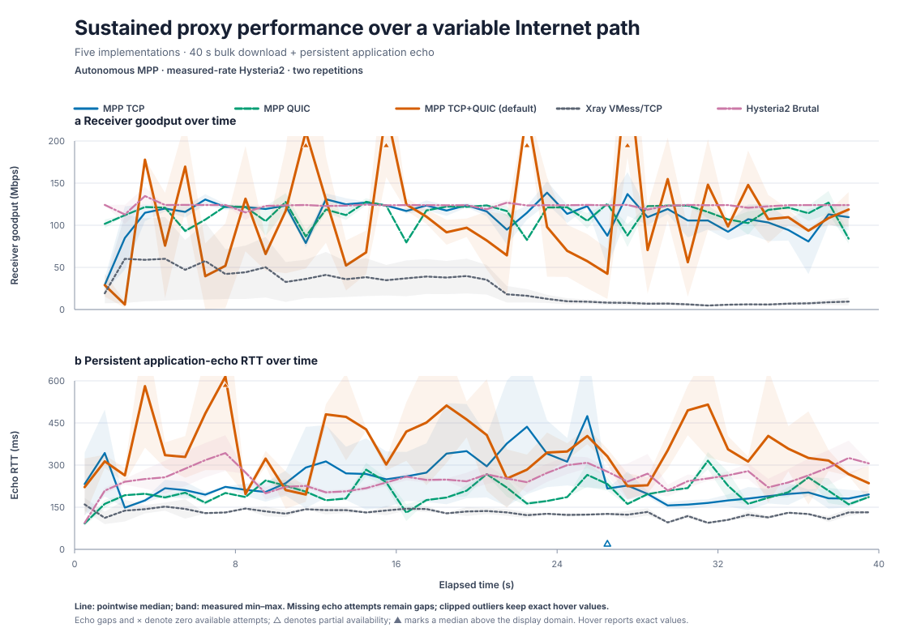

# Performance

MPTUNNEL aggregates independent links and keeps active traffic attached when a
carrier changes or disappears. Results depend on path conditions, direction,
workload, host capacity, and the native TCP or QUIC implementation.

## September 12 candidate comparison

This cohort measures the **v0.4.9 runtime at `2ced0d0`**, full source commit
`2ced0d03a388c614ff00692c3540fe306e378bf3`, with package version **0.4.9**, against
**`d1a99ad`**, the published v0.4.8 source. Both measured executables are optimized
local builds of the named sources. There are eighteen runs: one observation per
version for each of the nine comparisons below. The
[complete sampled series and source identities](assets/performance/v0.4.9-comparison-series.json)
accompany the figures; no repetitions, confidence bands or best-run selection
are implied.

The candidate completed all **310/310 download echo checks** and all **four upload
streams**, with target-confirmed bytes equal to locally accepted bytes and valid
sink-ACK accounting. It sustained useful service through the two impaired
profiles and recovered in the same running client. The observed costs below
remain part of acceptance. The default TCP+QUIC Cloudflare browser workload also
completed on this candidate. Linux/Windows/macOS/Android validation has the separate
build, test and package scope described below. These finite observations do not
establish universal non-regression.

### Conditions and accounting

All runs use isolated Linux containers on one host, the same paired configurations
and receiver probes, normal worker pools, and no diagnostic observer overrides.
Each version uses its own documented defaults: optional reinjection and QUIC loss
compensation are 10%/10% in v0.4.8 and 20%/20% in the candidate. This compares whole
versions, not the isolated causal effect of one mechanism or default.

- **Healthy:** one shared 500 Mbps link, 70 ms DOWN/30 ms UP, no injected loss,
  jitter, rate cut or blackhole; 25 seconds of offered load. TCP uses three default
  carriers, QUIC one; mixed uses both on that same physical link.
- **Independent:** three TCP carriers on one 200 Mbps link and one QUIC carrier on
  another 200 Mbps link, 70/30 ms, 40 seconds. QUIC forward capacity is restricted
  to 10 Mbps nominally at 15–25 seconds, with a UDP blackhole nominally at
  30–33 seconds. UP mirrors the impairment onto its sending direction.
- **Loss-clear:** QUIC, 500 Mbps, 70/30 ms, 40 seconds; 20% DOWN loss until the first
  existing profile epoch at or after 20 seconds, then zero. UP loss remains zero;
  no jitter, rate cut or blackhole is injected.

DOWN goodput measures ordered application-body delivery. Each finite download
intentionally stops with a partial 8 GiB HTTP 200 response at its duration limit.
UP measures target-sink confirmation arrival, including setup and settlement in
its whole-run elapsed time. Confirmation bins can burst above physical link rate;
that does not mean the target received new bytes at that instantaneous rate. UP
has no concurrent echo probe. The tunnel processes start before each probe, so
first-body/first-confirmation values cover application startup over established
carriers, not a separate cold-process startup test.

### Whole-run results

All paired values below are **published v0.4.8 → candidate**. DOWN gaps are between
application body reads; UP gaps are between target-sink confirmations. Echo p95
uses successful attempts only, with failures stated separately. Mbps is rounded
to one decimal, gaps to milliseconds and echo latency to whole milliseconds.

| Profile / transport | Direction | Goodput, Mbps | First delivery, s | Longest delivery gap, s | DOWN echo p95, ms |
| --- | --- | ---: | ---: | ---: | ---: |
| Healthy TCP | DOWN | 400.7 → 430.1 | 0.443 → 0.440 | 0.402 → 0.426 | 1129 → 334 |
| Healthy TCP | UP | 448.2 → 443.1 | 0.414 → 0.242 | 0.390 → 0.389 | Not measured |
| Healthy QUIC | DOWN | 429.0 → 412.5 | 0.406 → 0.410 | 0.102 → 0.101 | 166 → 249 |
| Healthy QUIC | UP | 427.4 → 430.5 | 1.108 → 0.208 | 0.295 → 0.273 | Not measured |
| Healthy TCP+QUIC | DOWN | 403.8 → 410.3 | 0.442 → 0.473 | 0.206 → 0.509 | 994 → 471 |
| Healthy TCP+QUIC | UP | 413.4 → 440.9 | 0.414 → 0.260 | 0.906 → 0.371 | Not measured |
| Independent TCP+QUIC | DOWN | 124.2 → 266.0 | 0.443 → 0.434 | 0.920 → 0.530 | 1860 → 353 |
| Independent TCP+QUIC | UP | 203.0 → 249.7 | 0.415 → 0.243 | 1.322 → 1.136 | Not measured |
| Loss-clear QUIC | DOWN | 209.3 → 393.7 | 1.703 → 0.725 | 0.437 → 0.442 | 231 → 350 |

Healthy candidate DOWN completes 50/50 echoes for each transport. The corresponding
v0.4.8 TCP/QUIC/mixed runs complete 36/36, 50/50 and 38/38. Independent candidate
DOWN completes 80/80 versus 64/64; loss-clear completes 80/80 versus 79/79.
Every recorded echo succeeds in this cohort. Slower sequential exchanges leave
fewer attempts within a fixed duration; an unattempted echo is not a timeout or
packet loss.

### Healthy service

Every candidate healthy one-second delivery bin is positive. TCP and mixed DOWN
improve whole-run goodput and echo p95 in this pair. QUIC DOWN is 3.8% slower; healthy
TCP UP is 1.1% slower. The candidate's healthy mixed maximum read gap increases
from 0.206 to 0.509 seconds, at 9.731–10.240 seconds, followed by continuing
delivery. The overlapping echo takes 706 ms; all 50 echoes succeed. Healthy mixed
DOWN median echo latency improves from 569 to 360 ms but remains well above the
configured 100 ms base RTT.

QUIC DOWN echo p95 rises from 166 to 249 ms. All candidate echoes above 150 ms
occur in the first four seconds; after five seconds its median/maximum are
105/140 ms. This timing distinguishes its startup cost from sustained loaded
latency. First delivery values for every workload remain visible in the table.

Candidate healthy uploads confirm 1,461,190,656 bytes over TCP, 1,426,587,648 over
QUIC and 1,448,411,136 over mixed paths. Their full elapsed times are 26.38, 26.51
and 26.28 seconds for 25 seconds of offered load. All accepted bytes are confirmed;
the extra elapsed time includes setup/settlement and is not an exact final-write
drain-time measurement.

### Independent links and recovery

Both versions keep their echo connection usable throughout this capture. The
candidate sustains much more ordered delivery when QUIC is restricted:

| Nominal probe phase | DOWN Mbps, prior → candidate | UP Mbps, prior → candidate |
| --- | ---: | ---: |
| Healthy, 5–15 s | 197.0 → 365.5 | 330.0 → 275.8 |
| Restricted, 15–25 s | 10.4 → 185.0 | 23.7 → 173.1 |
| Restored, 25–30 s | 220.9 → 348.3 | 278.1 → 277.8 |
| UDP outage, 30–33 s | 60.1 → 224.4 | 58.6 → 216.6 |
| Late recovery, 33–40 s | 152.1 → 207.6 | 160.7 → 264.3 |

During restriction, sampled TCP egress is about 188 Mbps in the candidate versus
14 Mbps in v0.4.8, while both QUIC paths send about 10 Mbps. Candidate TCP Native
ACK counters also show about 184 Mbps of service. The surviving TCP link thus
continues contributing to ordered application delivery. Wire transmission,
Native acknowledgements and application delivery use different byte/time
boundaries; their differences are not an exact recovery-overhead calculation.

Recovery is not immediately aggregate-optimal. Candidate DOWN stays around
172–192 Mbps in the first six bins after the nominal outage, then reaches
326 Mbps in the final bin as QUIC contributes more. UP has a restriction-phase
confirmation dip to 63 and 16 Mbps in bins 16/17, followed by 421 Mbps in bin 18.
These are confirmation-arrival intervals, including catch-up of earlier delivery.

Candidate independent UP confirms 1,330,839,552 bytes in 42.64 seconds, compared
with 1,073,545,216 bytes in 42.31 seconds; both exactly confirm all accepted bytes.
The maximum local-write gap improves from 1.693 to 0.789 seconds, distinct from
the confirmation gaps in the table. No concurrent UP echo latency was measured.

DOWN echo p95 improves from 1860 to 353 ms, but its median rises from 103 to
226 ms. Even before restriction, candidate median/p95 are 230/287 ms versus
103/214 ms. The candidate carries substantially more bulk traffic under the same
offered workload; these values describe the loaded experience rather than an
isolated latency effect of one change.

There is also a substantial healthy-phase disadvantage in this upload: over
5–15 seconds, candidate confirmations average **275.8 versus 330.0 Mbps**. The
disadvantage persists in both halves of that window. Its cause remains unresolved.
Existing path observations localize the lower service primarily to QUIC while
TCP continues near 185–190 Mbps; they do not identify the responsible admission
or native pacing/execution boundary. The bounded release prioritizes
usable continuity, exact transfers and the separately validated ownership/resource
corrections while retaining this documented limitation. The measured disadvantage
is not established as an inevitable cost of recovery, and aggregation is not ideal
in every phase.

Shading marks nominal probe time. Actual shaper samples and loss events keep their
own timestamps in the data; collection and commands are sequential. In DOWN,
the first recorded restored-rate states have collector elapsed labels of
25.632 seconds for the candidate versus 25.003 for v0.4.8; the first outage-off
states have labels of 33.934 versus 33.333 seconds. These labels precede the
sequential shaping commands and are not exact rule-completion timestamps. DOWN lacks an exact
probe-start wall-clock marker. Boundary bins therefore are not perfectly matched
intervention windows. A catch-up burst can release previously buffered data
rather than represent additional physical service.

### Loss and recovery after it clears

The candidate avoids the comparator's prolonged low-service interval in this run.
Mean DOWN goodput at 15–20 seconds is 385.8 versus 28.4 Mbps; at 20–25 seconds it
is 499.3 versus 88.4 Mbps. Both eventually return to useful service. The candidate
is slower late in recovery: at 30–40 seconds it delivers **414.5 versus
444.2 Mbps**, a 6.7% disadvantage.

Whole-run echo p95 is higher, **350 versus 231 ms**, and the maximum is 454 versus
409 ms. After clearance, candidate 30–40 second median/p95 improve to 105/115 ms
versus 121/208 ms. First body arrives sooner, at 0.725 versus 1.703 seconds. Every
actual echo succeeds in both versions. These timing differences accompany the
throughput result; the different version defaults prevent attribution to a single
change.

The loss-clear commands begin at profile elapsed 20.197 seconds for the candidate
and 20.694 seconds for v0.4.8. Exact probe-to-profile offsets are unavailable;
short receiver bins above 500 Mbps during clearance can drain buffered bytes and
do not establish higher physical link capacity.

### Resource costs and validation scope

Healthy mixed service uses more CPU, with higher server memory in DOWN:

| Workload | Peak server/client RSS, KiB, prior → candidate | Summed final endpoint CPU %, prior → candidate |
| --- | --- | ---: |
| Mixed DOWN | 124,940 / 75,180 → 213,164 / 61,980 | 131.5 → 139.1 |
| Mixed UP | 100,072 / 246,116 → 61,444 / 211,768 | 161.5 → 171.5 |

RSS is sampled process memory, not occupied heap. CPU here is the sum of the two
processes' final `ps` lifetime-average percentages, not instantaneous CPU or CPU per
delivered GB. These numbers record additional mixed-workload cost without proving
its cause. QUIC sender peak RSS is lower in this pair: server DOWN
358,868 → 187,520 KiB and client UP 384,004 → 185,432 KiB. Healthy QUIC UP summed
CPU rises from 176.6% to 186.1% while goodput changes by less than 1%.

The sampled healthy mixed wire/application quotients are 1.218 → 1.140 DOWN and
1.109 → 1.076 UP. They divide both endpoints' sampled HTB byte increases by
application bytes; sample boundaries differ from probe boundaries and copies,
framing and ACKs are not separately classified. They are comparative indicators,
not exact traffic-overhead percentages.

Under independent-link disruption, sampled server/client peak RSS falls from
218.4/69.5 to 180.2/51.5 MiB in DOWN and from 85.2/214.8 to 57.7/184.8 MiB in UP.
Loss-clear DOWN instead raises client peak RSS from 67.7 to 96.6 MiB while server
peak falls from 321.2 to 222.0 MiB. These are loaded process samples, not occupied
heap or post-teardown retention.

The loss-clear runs also include CPU tick deltas for stable process identities:

| Collector interval | Server/client CPU %, prior → candidate |
| --- | ---: |
| Loss, 5–20 s | 17.1 / 9.9 → 91.3 / 40.4 |
| After clearance, 25–40 s | 137.4 / 93.8 → 107.7 / 89.6 |

Here 100% means one logical CPU; percentages use actual elapsed time between
process observations. These interval values differ from the lifetime averages
above. The candidate does substantially more work during loss; after clearance
both endpoint CPU values are lower. Neither comparison attributes cost to a
particular function. The eighteen finite runs do not establish indefinite
sustainability, post-idle memory reuse, or behavior under many concurrent bulk
flows.

The release gate includes native platform tests and package/link checks for Linux,
Windows, macOS and Android. Results are recorded by [CI](https://github.com/mnihyc/mptunnel/actions/workflows/ci.yml)
and [Release Check](https://github.com/mnihyc/mptunnel/actions/workflows/release-check.yml).
Their build/test/package evidence does not establish Android VPN device performance,
macOS Network Extension behavior, or performance beyond the measured conditions.

### Actual browser workload

Chrome completed Cloudflare's download/upload workload through the default three
TCP carriers plus one QUIC carrier on **`2ced0d0`**. The page displayed 263 Mbps
DOWN, 234 Mbps UP, 198 ms idle latency and 199/198 ms loaded DOWN/UP median latency.
Loaded maxima were 569/315 ms. The workload completed all 31 download and 25 upload batches. The speed page and two concurrent Cloudflare
About/documentation navigations returned HTTP 200 and reached complete page state;
the concurrent pages loaded in 1.42/2.03 seconds.

There were zero console errors and five graphics performance warnings. The speed
page's captured request list contains 304 HTTP 200 responses, 18 aborted requests
(eleven map tiles and seven zero-byte phase-latency probes), and two requests with
unreported terminal outcomes. This is not a census of every tab's subresources,
and workload completion does not mean every page request completed.

Both endpoints retained the same session and their three TCP plus one QUIC
carrier identities throughout the observations. Every carrier's cumulative
Native ACK bytes increased from the initial snapshot to the in-progress snapshot
and again by completion, with unchanged endpoint-local direction and counter
epoch. This establishes TCP and
QUIC service in both directions during the capture. Final rates were stale or
unavailable; cumulative counters include navigation/control traffic and do not
establish a current rate or exact speed-test payload.

Public destination conditions were uncontrolled, so the displayed scores are a
browser smoke result, not a controlled throughput comparison.
Browser QUIC was disabled to honor the explicit HTTP proxy; the tunnel's QUIC
carrier remained enabled. The page's WebRTC/packet-loss display does not establish
tunneled UDP performance.

## Historical packet-reordering limitation

Older development snapshots and v0.4.8 exhibited a severe QUIC limitation under
deep packet reordering. **This schedule was not repeated in the September 12
candidate matrix.** The new restriction/loss-clear evidence does not establish
that this historical case is resolved.

The historical comparison used a forwarding router with 500 Mbps downstream,
100 Mbps upstream, 100 ms base RTT and unequal directional jitter, removed after
about eight seconds. No packet loss was injected. Both products kept the same
download connection; Hysteria2 2.10.0 used configured 500/100-Mbps Brutal rates.

The measured MPP snapshot reached about 450 Mbps roughly eight seconds after
jitter ended; Hysteria2 did so in roughly two seconds. Full-run receiver averages
were 294 and 363 Mbps. Hysteria2 had the longer bulk pause during reordering
(5.36 versus 1.80 seconds), but completed all 80 concurrent echoes. MPP's echo
timed out after four successes; subsequent observations were unavailable, not zero
latency. One run per product establishes that counterexample, not a general ranking.

Separate historical router runs with sustained jitter and no injected loss
measured 0.74 Mbps for the development MPP QUIC snapshot, 0.67 Mbps for v0.4.8 QUIC
and 9.39 Mbps for raw TCP. Router queue-drop counters stayed zero in that development
QUIC run. These observations retain their original limited scope and do not
characterize the newly measured candidate under the different profiles above.

## Historical ordered diagnostic series

The chart is the exact pointwise median and measured range of two 40-second
repetitions. It preserves one-second receiver-goodput and persistent
application-echo outcomes for MPTUNNEL TCP, QUIC, default TCP+QUIC, Xray
VMess/TCP, and Hysteria2 Brutal. MPTUNNEL estimated service autonomously while
Hysteria2 received the measured directional capacities. Missing echo values
remain gaps rather than zeroes; clipped display outliers retain their exact
values in hover text.

## v0.4.5-v0.4.8 accepted correctness evidence

These records describe bounded corrections in the identified earlier releases.
They are historical correctness evidence, not new throughput/latency measurements
or a product ranking of the September 12 candidate.

- Exact stream-attachment requalification uses a non-owning data-bearing probe,
  an exact attachment ACK, and fresh uniquely owned Product data to restore
  authority. Focused state-machine tests cover stale, acquiring, and qualified
  transitions plus sole-survivor handling in both directions; separate
  transport-dispatch tests cover the exact recovery frames while TCP and QUIC
  paths are idle. The focused Quinn runtime gate proves that a live QUIC
  response attachment requalifies in place without replacing its carrier
  connection, path instance, or incarnation: a pre-stale ACK restores no
  authority, and only a fresh uniquely owned OriginalData ACK returns the
  attachment to `Qualified`.
- Initial OPEN separates carrier admission from remote target settlement while
  retaining one logical stream ID and one target owner. Focused tests prove
  zero-credit admission precedes validation, retries preserve that identity,
  later target credit reaches live attachments, and target denial remains
  stream-scoped.
- QUIC full-bandwidth growth now compares the plateau baseline and growth sample
  in the same loss-compensated service-rate unit. A production-path red/green
  sequence proves the former mixed-unit plateau; zero-loss, 10x step-down, and
  token-policer controls preserve the existing behavior.
- Response scheduling now keeps delivery evidence direction-scoped and keeps
  mixed-path acquisition completion-ranked. Focused request and response
  regressions prove that a direction-unmeasured slower TCP path cannot claim
  the first exact data range ahead of a qualified lower-completion QUIC
  frontier, while bounded liveness fallback and ordinary reinjection behavior
  remain intact.
- QUIC Startup under an authorized erasure contract keeps backlogged capacity
  acquisition on the compensated full-bandwidth plateau. An aligned
  compensated high-loss exit remains available only when the exact completed
  epoch was and remains application-limited; raw congestion authority and
  zero-policy draft behavior are unchanged. Immediate randomized loss no
  longer ends backlogged Startup before representative bandwidth acquisition,
  while sustained app-limited excess loss retains its native escape.
- Live-owner recovery now preserves the exact frontier quantum used to rank an
  alternate through Product Apply. Larger target headroom cannot append an
  unranked suffix, while exact terminal failure retains prompt multi-quantum
  service. Symmetric request/response tests cover persistent gaps, finite
  tails, percentage invariance, exact target revalidation, and terminal
  failure. In the accepted matched dynamic-loss gate, QUIC-only and default
  TCP+QUIC delivered 336.156 and 332.393 Mbps; all 80 interactive probes in
  each case completed, with p95 latency of 414.06 and 414.63 ms. This is a
  bounded regression gate for the correction, not a general product ranking.

## Historical accepted fixed-profile evidence (v0.2.1–v0.2.2)

The fixed-profile tables in this section, through local processing capacity,
are accepted measurements of the exact v0.2.1–v0.2.2 binaries and
configurations used for those runs. They remain useful historical controls,
but they do not characterize the current tree or its defaults. A `default`
label in this section means the default of the measured historical release and
profile.

### Test conditions

Measurements used isolated GNU/Linux containers on one host. Rates are bytes
delivered to the receiver divided by full completion time; configured bandwidth
is never reported as throughput. The matched one-link and aggregation rows used
the same objects, two flows, and a 20-second load window. The asymmetric and
mixed-workload rows used 30-second windows. Each cell reports one valid
directional run, not a best-of selection. Repetitions were used only to classify
outliers. Xray-core 26.3.27 used VMess/TCP. Hysteria2 2.10.0 used Brutal with
client bandwidth equal to the shaped directional capacity. The measured
MPTUNNEL releases used their default shared-transport-key profile unless a
transport is named explicitly.

### Matched proxy conditions

Every path was shaped to 500 Mbps. Delay and jitter were applied once in each
direction; the table reports the approximate RTT and the configured
per-direction jitter. Every cell used two parallel downloads for 20 seconds.
MPTUNNEL used the measured release's default TCP+QUIC configuration.

| RTT (ms) | Jitter (ms) | Loss | Xray 26.3.27 VMess/TCP | Hysteria2 2.10.0 Brutal | MPTUNNEL TCP+QUIC |
| ---: | ---: | ---: | ---: | ---: | ---: |
| 40 | 10 | 0.5% | 441.353 | 463.502 | 414.200 |
| 280 | 20 | 10% | 70.833 | 96.288 | 194.504 |

In these historical rows, MPTUNNEL is 10.6% below the fastest baseline on the
ordinary path. Under
280 ms RTT, 20 ms jitter, and 10% loss it delivers 2.02× Hysteria2 and 2.75×
Xray/VMess. Every row has valid host, source, and receiver accounting.

### Link aggregation

Every physical link used the 500 Mbps, 40 ms RTT, 10 ms jitter, and 0.5% loss
profile above.

| System | Transport | Shaped links | Download (Mbps) | Upload (Mbps) |
| --- | --- | ---: | ---: | ---: |
| Xray | VMess/TCP | 1 | 441.353 | ≥337.788 |
| Hysteria2 | Brutal | 1 | 463.502 | ≥459.287 |
| MPTUNNEL | MPP/TCP+QUIC (default) | 1 | 414.200 | 425.335 |
| MPTUNNEL | MPP/TCP+QUIC (default) | 2 | 771.888 | 621.237 |
| Linux MPTCP | TCP | 5 | 884.667 | 2.572 |
| MPTUNNEL | MPP/TCP+QUIC (default) | 5 | 1,365.876 | 1,383.641 |

The measured historical default scales 1.86×/1.46× from one to two links and
3.30×/3.25× from one to five links for download/upload. Every MPTUNNEL result
completed with exact receiver accounting. The Xray and Hysteria2 upload
sessions did not close inside the completion window, so their
receiver-delivered values are lower bounds and are excluded from ratios.

The Linux kernel MPTCP control had additional subflows confirmed by runtime
`ss -M` evidence. Its upload result completed with exact receiver accounting
but collapsed under the independently jittered and lossy paths; it is reported
rather than replaced and is not used for a product ratio. MPTCP is not an
encrypted proxy.

### Per-flow TCP limits

In the measured releases, a lone TCP endpoint targeted the configured maximum
as regular members; the historical default maximum was three. When several
endpoints were configured, each endpoint contributed a regular primary and
correlated siblings remained ready backups. At collection time, `1-3` and
`3-3` both targeted three members. Live evidence decided which eligible
members received work; readiness did not create a fixed traffic share.

#### Independent 500 Mbps per-flow limits

| Direction | `1-1` | Default `1-3` | 3 × `1-1` |
| --- | ---: | ---: | ---: |
| Download (Mbps) | 346.354 | 904.757 | 902.027 |
| Upload (Mbps) | 338.889 | 931.537 | 901.967 |

#### Shared 200 Mbps bottleneck

| Direction | `1-1` | Default `1-3` | 3 × `1-1` |
| --- | ---: | ---: | ---: |
| Download (Mbps) | 157.495 | 164.943 | 171.062 |
| Upload (Mbps) | 157.938 | 153.374 | 165.704 |

The three-carrier forms aggregate independent per-flow capacity and stay near
the same aggregate ceiling when all connections share one bottleneck. No rate
or percentage from these runs is a production threshold.

### Changing link conditions at scale

Ten TCP and ten QUIC links changed bandwidth, latency, jitter, and loss across
five deterministic epochs.

| Rate/link (Mbps) | Transport | Download (Mbps) | Upload (Mbps) |
| ---: | --- | ---: | ---: |
| 30–100 | MPP/TCP+QUIC (default) | 346.911 | 295.621 |
| 300–1,000 | MPP/TCP+QUIC (default) | 1,476.501 | 517.327 |
| 3,000–10,000 | MPP/TCP+QUIC (default) | 2,055.416 | 559.959 |

For these historical runs, configured topology established regular and backup
eligibility. Fresh directional delivery evidence ranked members inside the
eligible tier. Neither source addresses nor fixed bandwidth thresholds
participated in that measured decision.

### Asymmetric links

Link A was 200 Mbps download / 20 Mbps upload. Link B was 20 Mbps download /
200 Mbps upload. A single Xray or Hysteria2 connection remained on Link A in
both directions; it was not moved to the directionally faster endpoint between
measurements. MPTUNNEL received both links in one configuration.

| System | Configured links | Download (Mbps) | Upload (Mbps) |
| --- | --- | ---: | ---: |
| Xray 26.3.27 VMess/TCP | A | 181.902 | ≥17.638 |
| Hysteria2 2.10.0 Brutal | A | 188.888 | ≥18.762 |
| MPTUNNEL MPP/TCP | A + B | 198.504 | 196.630 |

MPTUNNEL sent 90.7% of download traffic over Link A and 90.7% of upload
traffic over Link B. Independent single-fast-link MPTUNNEL controls delivered
183.436 Mbps download on Link A and 180.222 Mbps upload on Link B; adding both
links did not reduce either direction. Interface accounting, not source
address or configured bandwidth, supplies the path-share evidence.

### Latency and throughput together

The ordinary path was shaped to 80 Mbps, 40 ms RTT, 10 ms jitter, and 0.5%
loss. The adverse high-capacity path was shaped to 500 Mbps, 280 ms RTT, 20 ms
jitter, and 10% loss. Each control used the measured release's default
TCP+QUIC paths while bulk HTTP, short HTTP, persistent TCP echo, and UDP ran
together for 30 seconds.

| Available links | Bulk (Mbps) | TCP p50/p95 (ms) | TCP | HTTP p50/p95 (ms) | HTTP | UDP |
| --- | ---: | ---: | ---: | ---: | ---: | ---: |
| Ordinary only | 60.886 | 103 / 217 | 60/60 | 444 / 1,026 | 45/45 | 102/102 |
| Adverse only | 98.512 | 452 / 1,868 | 35/35 | 1,835 / 2,686 | 9/11 | 14/18 |
| Both | 160.002 | 173 / 318 | 60/60 | 376 / 838 | 53/53 | 205/205 |

The two single-link bulk controls sum to 159.398 Mbps; the two-link control
delivered 160.002 Mbps. With both links available, every TCP, HTTP, and UDP
check completed, interactive latency stayed far below the adverse-only
control, and bulk retained the combined capacity. This is a direct control for
latency-aware service and throughput aggregation, not an inference from path
counters alone.

### Disruption recovery

| Condition | Transport | Download (Mbps) | Upload (Mbps) | Receiver gap DL/UL (ms) |
| --- | --- | ---: | ---: | ---: |
| Port hop | MPP/QUIC | 2,818.042 | 2,798.515 | 11 / 24 |
| Blackhole | MPP/TCP+QUIC (default) | 278.488 | — | 636 / — |
| Latency change | MPP/TCP+QUIC (default) | 235.408 | — | 1,489 / — |
| Repeated link changes | MPP/TCP+QUIC (default) | 248.291 | — | 869 / — |
| Blackhole | MPP/TCP | 272.124 | 274.925 | 1,136 / 369 |
| Latency change | MPP/TCP | 253.904 | 221.276 | 315 / 1,625 |

| Default mixed condition | TCP echo | HTTP | Datagrams |
| --- | ---: | ---: | ---: |
| Blackhole | 60/60 | 72/72 | 228/229 |
| Latency change | 60/60 | 93/94 | 241/243 |
| Repeated link changes | 47/47 | 81/83 | 217/219 |

The latency-change row includes a 900 ms one-way, 10% loss epoch.
Persistent TCP echo streams stayed attached in every mixed disruption run.
The accepted historical blackhole row has clean source and host provenance;
every reliable check completed, while one unreliable datagram traversing the
blackholed path was not delivered.
The repeated-change HTTP misses began within deliberate blackholes and reached
their application deadlines before service returned. Datagram counts expose
expected loss during those same unavailable intervals.

| Event | Duration (s) | Continuity result |
| --- | ---: | --- |
| Total carrier outage | 5 | Existing flow recovered 1/1 |
| Server/client restart | — | Post-restart flows 2/2 |

In these measured releases, QUIC used native migration where available and TCP
established a fresh carrier. MPP retained exact logical ranges and resumed on
the replacement. New inbound connections were rejected while no outbound
carrier was available, while existing connections remained until their normal
timeout or recovery.

### Short connections

| Concurrency | Object (KiB) | Duration (s) | Requests | Rejected | Failed | Deadline (ms) |
| ---: | ---: | ---: | ---: | ---: | ---: | ---: |
| 10 | 32 | 30 | 90/90 | 0 | 0 | 3,000 |
| 20 | 1,024 | 60 | 755/755 | 0 | 0 | — |

The first run opened ten requests every three seconds. All 90 requests
completed inside the three-second deadline; the slowest batch took 0.681
seconds. The second kept twenty one-MiB transfers active and replaced each
completed request immediately.

### Local processing capacity

No rate, delay, jitter, or loss was configured. These rows measure the local
container and host path, not a public Internet link.

| System | Transport | Carriers | Download (Gbps) | Upload (Gbps) |
| --- | --- | ---: | ---: | ---: |
| Direct | TCP | 1 | 21.393 | 22.113 |
| Xray 26.3.27 | VMess/TCP | 1 | 8.044 | ≥6.952 |
| Hysteria2 2.10.0 | QUIC | 1 | 2.714 | ≥2.816 |
| MPTUNNEL | MPP/TCP (`1-1`) | 1 | 7.185 | 6.443 |
| MPTUNNEL | MPP/TCP (default) | 3 | 5.584 | 6.328 |
| MPTUNNEL | MPP/QUIC | 1 | 2.867 | 2.796 |
| MPTUNNEL | MPP/TCP+QUIC (default) | 4 | 4.921 | 5.190 |

The measured MPP data plane performed encryption, framing, sequencing,
scheduling, Data ACKs, flow control, and bounded recovery. Extra unshaped
carriers added processing and ordering work without adding link capacity.
Independently shaped links provided the aggregation opportunity measured above.

## Current diagnostic profiles

The optional `internet-five-path-load-coupled-epoch-N` diagnostic reuses the
same seeded five-path schedule but separates the link into a one-class HTB
rate limiter and a finite seeded-netem child. Netem supplies the scheduled
propagation, jitter floor, and exogenous packet effects. Below the scheduled
rate, packets see that floor. Sustained excess offered load consumes the
finite queue, so queue residence adds delay variation and overflow adds loss.
`MPTUNNEL_LAB_INTERNET_LOAD_QUEUE_DELAY` selects the additional full-size
packet queue horizon (default `100ms`); it is an input to diagnosis, not a
product threshold or a result pass/fail cap. Select this opt-in profile through
the heterogeneous runner; the random-Internet matrix keeps its static seeded
profile unless a separate load-coupled cohort is requested. Neither mode is a
Product threshold or an implicit performance cap.

## Current TCP ranged-carrier rotation

The current ranged-TCP lifecycle uses make-before-break replacement. During
planned rotation, a group may overlap at most one temporary authenticated
successor while its predecessor drains; the configured current-member maximum
remains unchanged. The successor starts with only its own readiness and live
delivery evidence. It does not inherit the
predecessor’s rate, RTT, congestion window, flight, ACK, queue, or path-score
evidence. This is the current lifecycle contract, not a fresh performance
claim inferred from the historical tables above.

## High-BDP resource windows

The four 64 MiB defaults are configurable local safety envelopes, not wire or
protocol limits:

- `max_stream_window_bytes` bounds per-direction logical receive credit;
- `max_repair_bytes` bounds retained sender data;
- `max_reorder_bytes` bounds receiver reordering; and
- `max_path_flight_bytes` bounds one path's MPP service flight.

Approximate aggregate BDP bytes as `sum(rate_bps × RTT_seconds) / 8`.
Aggregate admitted work is bounded by the applicable stream, repair, and
reorder envelopes plus the sum of independently applicable per-path flight
envelopes. Each path still needs enough `max_path_flight_bytes` for its own BDP.
Raise the relevant fields coherently on both endpoints only when diagnostics
show a window limit; `max_path_flight_bytes` must not exceed
`max_repair_bytes`. Higher values increase worst-case retained memory, so RAM
availability alone is not a sound automatic sizing signal.

At 64 MiB, one raw BDP is covered up to about 537 ms at 1 Gbps or 53.7 ms at
10 Gbps. At 10 Gbps and 100 ms RTT, a 64 MiB logical window has a rough
window/RTT ceiling of 5.37 Gbps and must be raised for line rate. See the
[reference configuration](../examples/config.reference.toml) and
[operations guide](OPERATIONS.md) for the operator surface.

## Reading the results

Each table or time-series figure establishes only its exact recorded cohort:
binary revision, configuration, carrier mix, direction, workload, duration,
network profile, and accepted host and source provenance. A historical
time-series figure is therefore evidence only for its own cohort. It does not
update the historical tables above, establish behavior outside its observation
window, or prove the cause of a rate or latency change by itself.

Interpret samples at the interval recorded by their cohort. The September 12
figures retain every raw one-second bin and actual echo attempt, with no smoothing
or variability bands. Echo failures remain explicit outcomes, and unavailable
latencies remain gaps. UP confirmation settlement is retained beyond offered load;
no later zero bins or missing UP echo series are fabricated. Whole quantiles come
from the probes. The historical fixed-profile runs used 200 ms delivery samples
and one-second management-rate samples; their derived series may aggregate further. Short zero or
spike buckets can reflect application buffering or ACK release. Diagnose
interruptions with ordered-delivery gaps, native service, Data ACK progress,
queue and flight ownership, interface drops, and the path lifecycle together.

Movement around five percent in the historical repetitions was treated as
ordinary run-to-run variance, not a pass threshold or a current regression
cap. Production contains no fixed Mbps target or fixed percentage threshold.

## Limits

These measurements do not establish:

- current-release performance from the historical v0.2.1–v0.2.2 tables;
- resolution of the historical deep-reordering case by the different September 12 profiles;
- performance outside any cohort's exact conditions or after its measured
  observation window;
- causality from a throughput or latency trace alone;
- performance on every public route or access technology;
- native Windows, Wintun, macOS Network Extension, or Android `VpnService`
  performance;
- identical host capacity for every packaged target;
- rankings against products not included in the matched tables; or
- an independent security audit of MPP.

The portable runtime is the correctness fallback on every supported platform.
Native host telemetry and VPN integration are used only where they provide a
real platform benefit.
