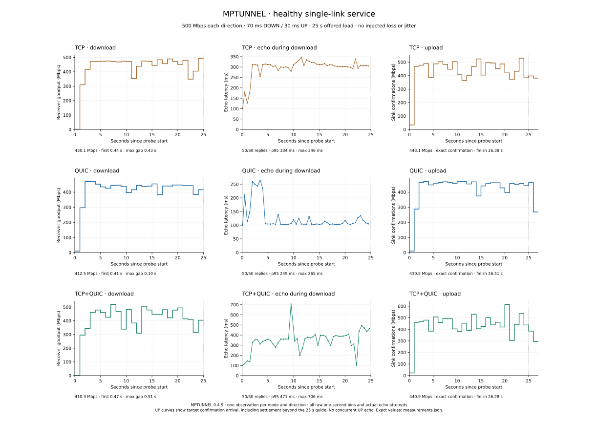
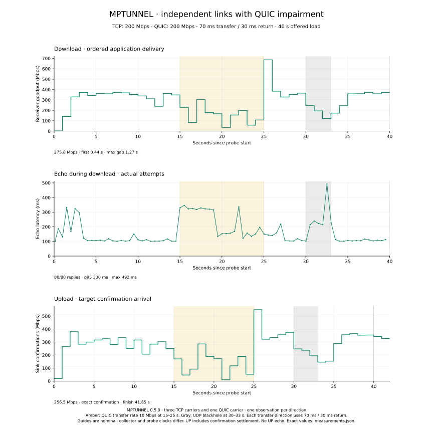
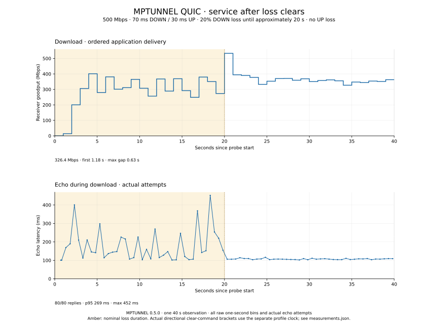
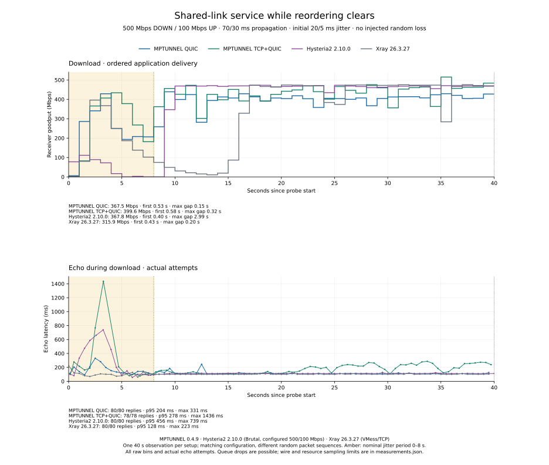

# Performance

MPTUNNEL can combine the capacity of independent links within one connection.
Paths sharing a bottleneck share its capacity. Throughput and latency also depend
on direction, packet loss, reordering, transport recovery and available CPU.

The measurements below use optimized Linux builds of MPTUNNEL 0.5.0, with the
standard 20% sender-policy defaults. Each configuration was measured once in
isolated containers. [Measurement data](assets/performance/measurements.json)
accompanies the timing plots. These observations describe the stated conditions,
rather than a guaranteed speed on every Internet connection.

## Healthy TCP, QUIC and mixed service

One shared 500 Mbps link has 70 ms downstream and 30 ms upstream delay, without
injected loss or jitter. TCP uses three carriers, QUIC one; mixed uses both on
the same link. Each workload offers traffic for 25 seconds.

| Transport | Download, Mbps | Upload, Mbps | First download body, s | Longest download gap, s | Loaded echo p95 / maximum, ms |
| --- | ---: | ---: | ---: | ---: | ---: |
| TCP | 424.2 | 437.9 | 0.480 | 0.395 | 323 / 354 |
| QUIC | 350.6 | 416.2 | 0.409 | 0.101 | 125 / 210 |
| TCP+QUIC | 418.9 | 437.4 | 0.477 | 0.836 | 438 / 500 |

QUIC has lower loaded echo latency here, while TCP and mixed deliver more
throughput. Combining transports on this shared link does not add physical
capacity. Each download completes all 50 actual echo requests without failure;
each upload confirms every accepted byte through final settlement.

The tunnel processes are already running when each application starts.
First-body timing includes proxy setup, stream attachment and the first
application bytes. Echo is a concurrent 64-byte TCP exchange whose latency
includes loaded-network effects. Upload has no concurrent echo measurement.

## Independent links with QUIC restriction

Three TCP carriers use one 200 Mbps link and one QUIC carrier uses another
200 Mbps link. Each 40-second workload has 70 ms delay in its transfer direction
and 30 ms on the return path. Thus upload uses 70 ms upstream and 30 ms downstream.
QUIC's transfer rate is restricted to 10 Mbps at nominal seconds 15–25, followed
by a UDP blackhole at seconds 30–33.

| Nominal phase | Download, Mbps | Upload confirmations, Mbps |
| --- | ---: | ---: |
| Healthy, 5–15 s | 341.5 | 286.7 |
| QUIC restricted, 15–25 s | 151.2 | 132.2 |
| Rate restored, 25–30 s | 423.6 | 387.3 |
| UDP outage, 30–33 s | 187.4 | 226.2 |
| Recovery, 33–40 s | 320.3 | 287.7 |

Restriction reduces useful delivery despite the independent TCP link. These are
phase averages, not a guarantee of continuous service: whole-workload download
is 275.8 Mbps, with a longest body-read gap of 1.272 s. All 80 echo requests
complete, with p95 of 330 ms and a maximum of 492 ms.

Upload confirms all 1,341,980,672 accepted bytes in 41.85 s, averaging 256.5 Mbps.
Its longest confirmation gap is 0.760 s. The extra elapsed time includes setup
and final settlement. Restored-phase rates include catch-up delivery of buffered
data; a short application-delivery or confirmation interval can exceed nominal
physical capacity. Restoring a link does not immediately restore its full
aggregate contribution. The plots retain these recovery intervals in both directions.

## Loss and recovery

A QUIC download uses a 500 Mbps link with 70/30 ms directional delay. Downstream
random loss is 20% until nominal profile time 20 seconds, then clears; upstream
loss is zero. The clearing command for the active downstream link runs between
20.109 and 20.207 s on the separate profile clock. The plotted guide is nominal
probe time, not an exact packet-level boundary.

Whole-workload download is 326.4 Mbps. First body arrives in 1.181 s and the
longest subsequent body-read gap is 0.626 s. All 80 echoes complete, with p95
of 269 ms and a maximum of 452 ms. Delivery over seconds 30–40 averages
351.2 Mbps. The figure shows startup and recovery alongside throughput.

## Reordering and other transports

The shared routed link provides 500 Mbps downstream and 100 Mbps upstream,
with 70/30 ms delay. Initial directional jitter is 20/5 ms and clears nominally
at eight seconds. Each product runs a 40-second download with concurrent echo.
Hysteria2 uses version 2.10.0 with Brutal configured for 500/100 Mbps; Xray uses
version 26.3.27 with VMess/TCP.

| Product | Download, Mbps | First body, s | Longest bulk gap, s | Echo p95 / maximum, ms | Successful / attempted echoes |
| --- | ---: | ---: | ---: | ---: | ---: |
| MPTUNNEL QUIC | 328.2 | 0.501 | 0.109 | 152 / 237 | 80 / 80 |
| MPTUNNEL TCP+QUIC | 408.8 | 0.511 | 0.312 | 369 / 377 | 80 / 80 |
| Hysteria2 | 366.6 | 0.468 | 1.512 | 412 / 747 | 79 / 79 |
| Xray VMess/TCP | 288.8 | 0.496 | 0.108 | 126 / 221 | 80 / 80 |

During seconds 20–40, MPTUNNEL QUIC averages 343.4 Mbps, mixed 451.1 Mbps,
Hysteria2 464.0 Mbps and Xray 471.5 Mbps. QUIC's lower late throughput is a
material cost in this profile. Mixed approaches the other transports' late
throughput, while its late median echo latency is 343 ms, compared with
112 ms for Hysteria2 and 104 ms for Xray. Whole averages alone hide these
throughput and responsiveness differences.

All actual echoes complete without failure. The sequential probe starts its
next request only after the preceding one completes, so 79 attempts does not
mean a missing reply. No random loss is configured, but Hysteria2 records
14,197 downstream router queue drops; the other three runs record none.
Identical configured conditions do not imply identical realized loss or a
universal product ranking.

## CPU, memory and traffic

Transport work has a material CPU and memory cost. Healthy mixed download uses
100.9%/54.7% server/client CPU over matched process sampling intervals of about
25.1 seconds, where 100% is one core. Its peak server/client RSS is
106,172/51,604 KiB. These are interval CPU measurements and sampled residency,
not evidence about indefinite memory retention.

The reordering cohort has a different CPU measure: final sampled process-lifetime
averages. MPTUNNEL QUIC records 95.6%/63.2% server/client, with peak RSS of
155,184/40,028 KiB. Xray records 4.3%/8.1% and 37,164/37,360 KiB. These lifetime
averages are not interchangeable with the interval measurements above or CPU
per delivered byte.

For healthy mixed service, sampled combined endpoint egress divided by application
bytes is 1.115 for download and 1.062 for upload. Sampling boundaries differ from
the application window, and framing, acknowledgements, retransmissions and
recovery copies are not individually separated. These quotients are not exact
overhead percentages.

High-bandwidth, high-RTT paths also need sufficient flow-control and retention
windows. Approximate bandwidth-delay product as `rate_bps × RTT_seconds / 8`.
A 64 MiB window covers about 537 ms at 1 Gbps. Larger windows can support more
in-flight data but increase memory exposure. See the
[reference configuration](../examples/config.reference.toml) and
[operations guide](OPERATIONS.md) for sizing options.

## Reading the measurements

Download goodput counts ordered application-body delivery. Duration-limited
HTTP downloads intentionally stop before the full 8 GiB object completes.
Upload goodput counts target-sink confirmation arrival, including final settlement;
a catch-up confirmation bin can exceed the physical link rate without implying
that new bytes reached the target at that instantaneous rate.

Plots preserve raw one-second bins and every actual echo attempt. Shaded phases
are nominal probe time; collection and shaping commands have separate timestamps.
Boundary bins are approximate intervention windows. Loaded latency, startup,
gaps and recovery accompany throughput because each affects ordinary use.

The measurements use one Linux host. Native platform builds and tests are
available through [CI](https://github.com/mnihyc/mptunnel/actions/workflows/ci.yml),
but they do not establish identical performance on Windows, macOS or Android.
