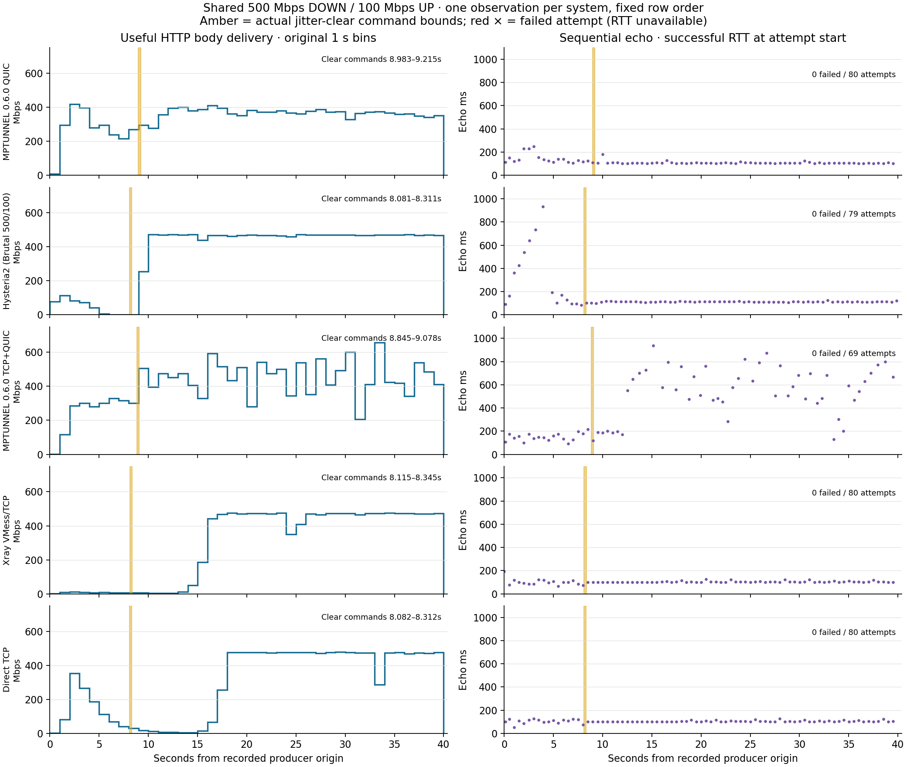

# Benchmark measurements

This reference contains the complete comparison tables, timing plots and test
conditions behind the [performance guide](PERFORMANCE.md). Start with the guide
for a tour of multipath transfers, responsiveness and resource use.

## MPTUNNEL 0.6.0 observations

These one-run Linux observations use the MPTUNNEL 0.6.0 development build
from source `1e8abedf` and the published MPTUNNEL 0.5.2 build. Exact source and
artifact digests are recorded in the [observation data](assets/performance/current-observations.json).
Each exact condition has one observation per binary; these results are descriptive,
not a repeatability claim or universal ranking.

### Ordinary mixed transfers

The ordinary rows use one shared 500 Mbps physical link, 70 ms server-side and 30 ms
client-side delay, and no configured jitter or loss. Each 25-second transfer has
25 quiet HTTP offers before and after, plus 55 loaded offers at a 500 ms interval;
each offer requests a 100 kB body with a 2.5-second response budget. The 500 Mbps
configured path capacity is not an offered application rate. Download goodput is
ordered body delivery; upload goodput is target-confirmed bytes including final
settlement.

| Direction | 0.6.0 goodput, Mbps | 0.5.2 goodput, Mbps | Loaded offers: 0.6.0 | Loaded offers: 0.5.2 |
| --- | ---: | ---: | --- | --- |
| Download | 406.7 | 410.6 | 55/55 full bodies; 0 failures; 7 late | 49/55 full bodies; 6 failures; 17 late |
| Upload | 444.4 | 446.4 | 55/55 full bodies; 0 failures; 1 late | 55/55 full bodies; 0 failures; 10 late |

A late offer completed but exceeded its scheduled response budget. Failures and
late completions are reported separately from transfer goodput.

### Independent-link download during a QoS change and UDP outage

The matching 40-second download uses the same two independent 200 Mbps links,
with QUIC restriction scheduled for seconds 15–25 and a UDP outage for seconds
30–33. Recorded commands and full time series are in the
[independent-link data](assets/performance/independent-paths-series.json).

| Build | Download goodput, Mbps | Full-body HTTP offers | Failed offers | Late offers |
| --- | ---: | ---: | ---: | ---: |
| 0.6.0 development | 267.7 | 80 / 85 | 5 | 3 |
| 0.5.2 published | 277.7 | 78 / 85 | 7 | 0 |

Each download also completes all 80 sequential echo exchanges. For 0.6.0,
echo p95 is 326.5 ms and the longest gap between download body reads is 0.793 s.
The fixed HTTP offers fetch 100 kB bodies with a 2.5-second response budget;
they measure a different workload from the 64-byte echo exchanges.

### Independent-link upload during a QoS change and UDP outage

This separate 40-second upload uses two independent 200 Mbps paths, QUIC on link
46 and TCP on link 47, with mirrored 30/70 ms directional delay and no configured
jitter or random loss. Link 46 is shaped to 10 Mbps from the first observed epoch
in nominal seconds 15–25; UDP is blocked at the endpoints for nominal seconds
30–33. The loaded phase schedules 85 fixed HTTP offers alongside the upload.

| Build | Upload goodput, Mbps | Full-body offers | Failed offers | Late offers | Budget misses |
| --- | ---: | ---: | ---: | ---: | ---: |
| 0.6.0 development | 213.1 | 80 / 85 | 5 | 6 | 11 |
| 0.5.2 published | 257.4 | 85 / 85 | 0 | 0 | 0 |

Client process CPU per delivered GiB in this pair was 33.450 s user and 7.909 s kernel for 0.6.0, versus 22.078 s user and 6.790 s kernel for 0.5.2. These sampled-counter quotients are not total-machine CPU. This one paired observation is specific to that independent-link upload and its scheduled impairment; it does not predict behavior in other rows.

### Mixed traffic with link assignment changes

These 60-second mixed-traffic rows use two links with 500 and 200 Mbps configured
rates and 125 loaded HTTP offers per row. Normal assignment places QUIC/500 on
link 46 and TCP/200 on link 47. Capacity reversal keeps those physical protocol
assignments but changes the rates to QUIC/200 and TCP/500. Identity swap keeps
QUIC at 500 Mbps and TCP at 200 Mbps while exchanging the physical link IDs:
TCP moves from 47 to 46, and QUIC moves from 46 to 47. The 700 Mbps sum is
configured path capacity, not an offer count or an application rate.

| Assignment | Direction | 0.6.0 goodput, Mbps | 0.5.2 goodput, Mbps | Full-body offers, 0.6.0 / 0.5.2 | Late offers, 0.6.0 / 0.5.2 |
| --- | --- | ---: | ---: | ---: | ---: |
| Normal | Download | 309.8 | 279.5 | 125 / 125 | 0 / 0 |
| Normal | Upload | 244.0 | 258.5 | 125 / 124 | 0 / 2 |
| Capacity reversed | Download | 302.2 | 295.9 | 125 / 125 | 0 / 0 |
| Capacity reversed | Upload | 450.6 | 435.6 | 125 / 124 | 1 / 9 |
| Physical link identities swapped | Download | 226.1 | 242.7 | 125 / 125 | 0 / 0 |
| Physical link identities swapped | Upload | 415.5 | 349.7 | 125 / 125 | 0 / 0 |

These are separate one-run observations. Results vary by direction and link
assignment, so they do not establish a general winner.

### Five-minute mixed transfers

The sustained mixed rows run for 300 seconds with a 500 Mbps QUIC path and a
200 Mbps TCP path. The QUIC path receives scheduled variable delay, jitter and
loss updates, including three-second impairment spikes at nominal seconds 60,
149 and 232; TCP stays on its baseline profile. The baseline is 70 ms delay
with 10 ms jitter and 0.3% loss on server egress, and 30 ms delay with 3 ms
jitter and 0.1% loss on client egress. The [observation data](assets/performance/current-observations.json)
records the complete schedule. Each direction was measured once per artifact.

| Direction | 0.6.0 goodput, Mbps | 0.5.2 goodput, Mbps | 0.6.0 bidirectional wire / byte | 0.5.2 bidirectional wire / byte |
| --- | ---: | ---: | ---: | ---: |
| Download | 225.6 | 255.1 | 1.776 | 1.715 |
| Upload | 387.2 | 266.3 | 1.258 | 1.444 |

Wire per byte is combined endpoint egress divided by delivered application bytes;
it includes control, feedback and retransmission traffic and is not a pure
protocol-overhead percentage.

### Shared-link comparison

The figure compares one 40-second observation per system on a shared 500 Mbps
down / 100 Mbps up link, with 70/30 ms directional delay. Initial jitter is
20 ms downstream and 5 ms upstream, cleared at a nominal 8 seconds; the figure
marks the separate per-run clear-command intervals. No random loss was configured.
The bulk test is a time-limited HTTP body read. The echo test sends sequential
64-byte exchanges at a nominal 500 ms interval with a 3-second timeout, so the
number of offers depends on how quickly each prior exchange completes.

| System | Goodput, Mbps | Successful echo p95, ms | Echo successes / attempts | Process CPU, client / server s/GiB |
| --- | ---: | ---: | ---: | ---: |
| MPTUNNEL QUIC | 343.4 | 154 | 80 / 80 | 17.6 / 25.1 |
| Hysteria2 | 366.6 | 427 | 79 / 79 | 22.1 / 20.5 |
| MPTUNNEL TCP+QUIC | 406.3 | 797 | 69 / 69 | 13.0 / 22.6 |
| Xray VMess/TCP | 286.3 | 122 | 80 / 80 | 2.5 / 1.2 |
| Direct TCP | 294.8 | 122 | 80 / 80 | — |

This comparison uses Hysteria2 2.10.0 with Brutal configured at 500/100 Mbps,
and Xray 26.3.27 with VMess/TCP, user cipher `security: auto`, TCP transport,
and no configured mux or TLS. The three MPTUNNEL mixed TCP carriers reported
BBR in socket readbacks; this was an observed native controller, not a config
override. Endpoint quotas were four CPUs and the router quota was two CPUs.
CPU values are sampled process counters divided by whole-probe delivered GiB;
they are not total-machine CPU or CPU per aligned time window. Direct TCP has
no tunnel-process CPU measurement. One run per system cannot rank behavior on
other routes or workloads.

## Historical v0.5.0 measurements

The measurements below use optimized Linux builds of MPTUNNEL 0.5.0, with the
standard 20% sender-policy defaults. Each configuration was measured once in
isolated containers. [Measurement data](assets/performance/measurements.json)
accompanies the timing plots. These observations describe the stated conditions,
rather than a guaranteed speed on every Internet connection.

### Healthy TCP, QUIC and mixed service

One shared 500 Mbps link has 70 ms downstream and 30 ms upstream delay, without
injected loss or jitter. TCP uses three carriers, QUIC one; mixed uses both on
the same link. Each workload offers traffic for 25 seconds.

| Transport | Download, Mbps | Upload, Mbps | First download body, s | Longest download gap, s | Loaded echo p95 / maximum, ms |
| --- | ---: | ---: | ---: | ---: | ---: |
| TCP | 424.2 | 437.9 | 0.480 | 0.395 | 323 / 354 |
| QUIC | 350.6 | 416.2 | 0.409 | 0.101 | 125 / 210 |
| TCP+QUIC | 418.9 | 437.4 | 0.477 | 0.836 | 438 / 500 |

QUIC has lower loaded echo latency here, while TCP and mixed deliver more
throughput. Combining transports on this shared link does not add physical
capacity. Each download completes all 50 actual echo requests without failure;
each upload confirms every accepted byte through final settlement.

The tunnel processes are already running when each application starts.
First-body timing includes proxy setup, stream attachment and the first
application bytes. Echo is a concurrent 64-byte TCP exchange whose latency
includes loaded-network effects. Upload has no concurrent echo measurement.

### Independent links with QUIC restriction

Three TCP carriers use one 200 Mbps link and one QUIC carrier uses another
200 Mbps link. Each 40-second workload has 70 ms delay in its transfer direction
and 30 ms on the return path. Thus upload uses 70 ms upstream and 30 ms downstream.
QUIC's transfer rate is restricted to 10 Mbps at nominal seconds 15–25, followed
by a UDP blackhole at seconds 30–33.

| Nominal phase | Download, Mbps | Upload confirmations, Mbps |
| --- | ---: | ---: |
| Healthy, 5–15 s | 341.5 | 286.7 |
| QUIC restricted, 15–25 s | 151.2 | 132.2 |
| Rate restored, 25–30 s | 423.6 | 387.3 |
| UDP outage, 30–33 s | 187.4 | 226.2 |
| Recovery, 33–40 s | 320.3 | 287.7 |

Restriction reduces useful delivery despite the independent TCP link. These are
phase averages, not a guarantee of continuous service: whole-workload download
is 275.8 Mbps, with a longest body-read gap of 1.272 s. All 80 echo requests
complete, with p95 of 330 ms and a maximum of 492 ms.

Upload confirms all 1,341,980,672 accepted bytes in 41.85 s, averaging 256.5 Mbps.
Its longest confirmation gap is 0.760 s. The extra elapsed time includes setup
and final settlement. Restored-phase rates include catch-up delivery of buffered
data; a short application-delivery or confirmation interval can exceed nominal
physical capacity. Restoring a link does not immediately restore its full
aggregate contribution. The plots retain these recovery intervals in both directions.

### Loss and recovery

A QUIC download uses a 500 Mbps link with 70/30 ms directional delay. Downstream
random loss is 20% until nominal profile time 20 seconds, then clears; upstream
loss is zero. The clearing command for the active downstream link runs between
20.109 and 20.207 s on the separate profile clock. The plotted guide is nominal
probe time, not an exact packet-level boundary.

Whole-workload download is 326.4 Mbps. First body arrives in 1.181 s and the
longest subsequent body-read gap is 0.626 s. All 80 echoes complete, with p95
of 269 ms and a maximum of 452 ms. Delivery over seconds 30–40 averages
351.2 Mbps. The figure shows startup and recovery alongside throughput.

### Reordering and other transports

The shared routed link provides 500 Mbps downstream and 100 Mbps upstream,
with 70/30 ms delay. Initial directional jitter is 20/5 ms and clears nominally
at eight seconds. Each product runs a 40-second download with concurrent echo.
Hysteria2 uses version 2.10.0 with Brutal configured for 500/100 Mbps; Xray uses
version 26.3.27 with VMess/TCP.

| Product | Download, Mbps | First body, s | Longest bulk gap, s | Echo p95 / maximum, ms | Successful / attempted echoes |
| --- | ---: | ---: | ---: | ---: | ---: |
| MPTUNNEL QUIC | 328.2 | 0.501 | 0.109 | 152 / 237 | 80 / 80 |
| MPTUNNEL TCP+QUIC | 408.8 | 0.511 | 0.312 | 369 / 377 | 80 / 80 |
| Hysteria2 | 366.6 | 0.468 | 1.512 | 412 / 747 | 79 / 79 |
| Xray VMess/TCP | 288.8 | 0.496 | 0.108 | 126 / 221 | 80 / 80 |

During seconds 20–40, MPTUNNEL QUIC averages 343.4 Mbps, mixed 451.1 Mbps,
Hysteria2 464.0 Mbps and Xray 471.5 Mbps. QUIC's lower late throughput is a
material cost in this profile. Mixed approaches the other transports' late
throughput, while its late median echo latency is 343 ms, compared with
112 ms for Hysteria2 and 104 ms for Xray. Whole averages alone hide these
throughput and responsiveness differences.

All actual echoes complete without failure. The sequential probe starts its
next request only after the preceding one completes, so 79 attempts does not
mean a missing reply. No random loss is configured, but Hysteria2 records
14,197 downstream router queue drops; the other three runs record none.
Identical configured conditions do not imply identical realized loss or a
universal product ranking.

### CPU, memory and traffic

Transport work has a material CPU and memory cost. Healthy mixed download uses
100.9%/54.7% server/client CPU over matched process sampling intervals of about
25.1 seconds, where 100% is one core. Its peak server/client RSS is
106,172/51,604 KiB. These are interval CPU measurements and sampled residency,
not evidence about indefinite memory retention.

The reordering cohort has a different CPU measure: final sampled process-lifetime
averages. MPTUNNEL QUIC records 95.6%/63.2% server/client, with peak RSS of
155,184/40,028 KiB. Xray records 4.3%/8.1% and 37,164/37,360 KiB. These lifetime
averages are not interchangeable with the interval measurements above or CPU
per delivered byte.

For healthy mixed service, sampled combined endpoint egress divided by application
bytes is 1.115 for download and 1.062 for upload. Sampling boundaries differ from
the application window, and framing, acknowledgements, retransmissions and
recovery copies are not individually separated. These quotients are not exact
overhead percentages.

High-bandwidth, high-RTT paths also need sufficient flow-control and retention
windows. Approximate bandwidth-delay product as `rate_bps × RTT_seconds / 8`.
A 64 MiB window covers about 537 ms at 1 Gbps. Larger windows can support more
in-flight data but increase memory exposure. See the
[reference configuration](../examples/config.reference.toml) and
[operations guide](OPERATIONS.md) for sizing options.

### Reading the measurements

Download goodput counts ordered application-body delivery. Duration-limited
HTTP downloads intentionally stop before the full 8 GiB object completes.
Upload goodput counts target-sink confirmation arrival, including final settlement;
a catch-up confirmation bin can exceed the physical link rate without implying
that new bytes reached the target at that instantaneous rate.

Plots preserve raw one-second bins and every actual echo attempt. Shaded phases
are nominal probe time; collection and shaping commands have separate timestamps.
Boundary bins are approximate intervention windows. Loaded latency, startup,
gaps and recovery accompany throughput because each affects ordinary use.

The measurements use one Linux host. Native platform builds and tests are
available through [CI](https://github.com/mnihyc/mptunnel/actions/workflows/ci.yml),
but they do not establish identical performance on Windows, macOS or Android.
